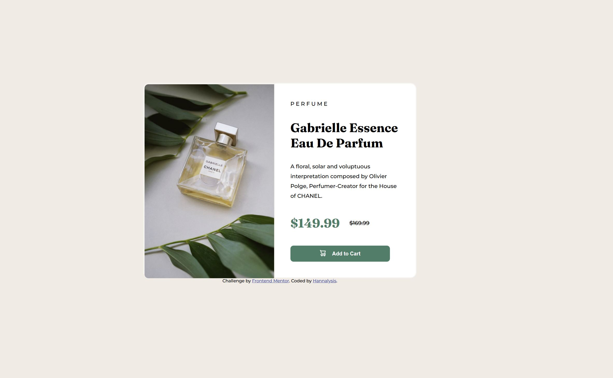
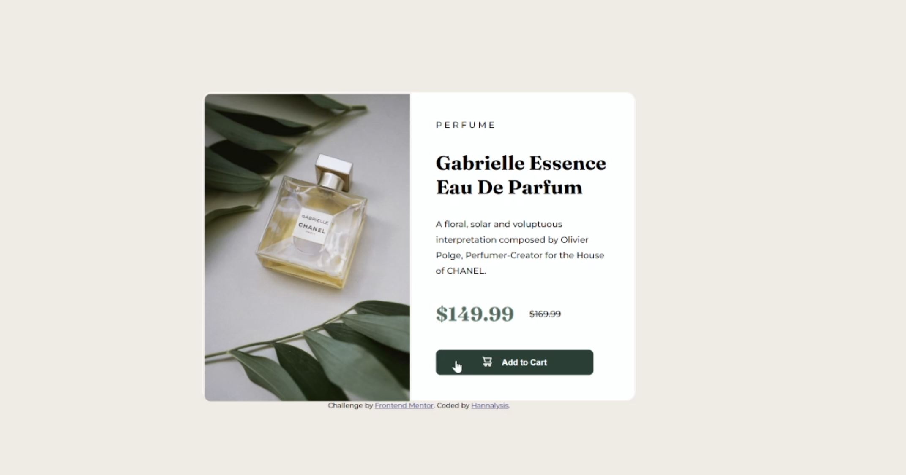

<h1 style = "text-align: center;">Frontend Mentor - Product preview card component solution</h1>

This is a solution to the [Product preview card component challenge on Frontend Mentor](https://www.frontendmentor.io/challenges/product-preview-card-component-GO7UmttRfa). Frontend Mentor challenges help you improve your coding skills by building realistic projects. 

<h1 style = "text-align: center;">Table of Contents</h1>

- [Overview](#overview)
  - [The challenge](#the-challenge)
  - [Screenshot](#screenshot)
  - [Links](#links)
- [My process](#my-process)
  - [Built with](#built-with)
  - [What I learned](#what-i-learned)
  - [Continued development](#continued-development)
- [Author](#author)

<h1 style = "text-align: center;">Overview</h1>

### The challenge

<i>The Original - Desktop Design:</i>
  


<i>The Original - Active States:</i>
  


Your challenge is to build out this product preview card component and get it looking as close to the design as possible.

Users should be able to:

- View the optimal layout depending on their device's screen size (for desktop only)
- See hover and focus states for interactive elements

### My Solution Screenshots
------------

<i>Screenshot for the desktop design:</i>  
  


<i>Screenshot for the active states:</i>  
  



### Links

- Live Site URL: [github-pages](https://hannalysis.github.io/Front-End-Mentor-Product-preview-card-component/)

<h1 style = "text-align: center;">My Process</h1>

### Built with

<p>
  <a href="https://skillicons.dev">
    
  </a>
</p>

### What I learned

As this was my first real CSS challenge outside of the Landing Page project in The Odin Project Foundations course, I wanted to break down this task into a few actionable todo points:

<h5><u>Main Challenge</u></h5>

- Create the essential containers, and centre the content in the middle of the page
- Get the main content box shape correct, and soften the applicable corners 
- Get rid of any unnecessary scrolling of the page, and ensure the content remains centered 
- Add the remainder of the text elements, fonts and necessary containers inside product information container (right-facing container)
- Pull out the pricing elements separately so they can be uniquely modified
- Touch up with final styling and formatting changes; including that all the text, button and pricing inside the product information container is left aligned together

<h5><u>Update 1</u></h5>

<p><i>When I came back to this project a couple of days later to update this README file, I realised I had forgotten to implement the active-states part of the challenge!</i><p>

- Add Active Styling to the Cart Button (aka hover with darken and cursor set to pointer)

<h4><u>Code snippets of note</u></h4>

The snapshot css below represents what I needed to do to achieve not just the main centered containers soft edges, but with the left side of the image almost mirroring those soft edges, with a few px short so it fits inside appropriately.

```css
.centre-container{
...
    border-radius: 16px;
}
.product-image {
    border-style: double;
    border-color: hsl(30, 38%, 92%);
    border-top-left-radius: 12px; /* To soften the left side border on the img */
    border-bottom-left-radius: 12px; /* To soften the left side border on the img */
    ...
}
```
The example below was my first practical use case of space-between. Once I realised I could utilise this property in this situation, it felt great to remove the redundant numeral margins/gaps etc within this container, in favour for this spacing technique.

```css
.product-information-container {
    padding: 40px;
    display: flex;
    flex-direction: column;
    justify-content: space-between;
}

```

### Continued development

I'd like to allocate some time to make the mobile view variant of this challenge.

<h2>Author</h2>

Hannahry aka [Hannalysis](https://github.com/Hannalysis)
